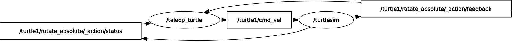

# quick start

start publisher, listener and graph
```
ros2 run demo_nodes_cpp talker
ros2 run demo_nodes_cpp listener
rqt_graph
```

# my_robot_controller

## setup
download vscode and use vscode extension: ROS

```
alan@alan-VirtualBox:~/git/rob521/ros2_ws$ colcon build
source ~/git/rob521/ros2_ws/install/setup.bash 
alan@alan-VirtualBox:~/git/rob521/ros2_ws$ ros2 pkg create my_robot_controller --build-type ament_python --dependencies rclpy
```

`colcon` is the build tool and `ament` is the build system

## build projct

node name = 'first_node'
exe 

```
cd ros2_ws
colcon build # or 'colcon build --symlink-install' if want hot reload
source ~/.bashrc
ros2 run my_robot_controller test_node
```

## turtlesim overview


## usful cmd
### show message interface
```
alan@alan-VirtualBox:~/Desktop$ ros2 interface show geometry_msgs/msg/Twist
# This expresses velocity in free space broken into its linear and angular parts.

Vector3  linear
	float64 x
	float64 y
	float64 z
Vector3  angular
	float64 x
	float64 y
	float64 z
```

### monitor node

```
alan@alan-VirtualBox:~/git/ros2_ws/src/my_robot_controller$ ros2 node info /first_node
/first_node
  Subscribers:

  Publishers:
    /parameter_events: rcl_interfaces/msg/ParameterEvent
    /rosout: rcl_interfaces/msg/Log
  Service Servers:
    /first_node/describe_parameters: rcl_interfaces/srv/DescribeParameters
    /first_node/get_parameter_types: rcl_interfaces/srv/GetParameterTypes
    /first_node/get_parameters: rcl_interfaces/srv/GetParameters
    /first_node/list_parameters: rcl_interfaces/srv/ListParameters
    /first_node/set_parameters: rcl_interfaces/srv/SetParameters
    /first_node/set_parameters_atomically: rcl_interfaces/srv/SetParametersAtomically
  Service Clients:

  Action Servers:

  Action Clients:
```
