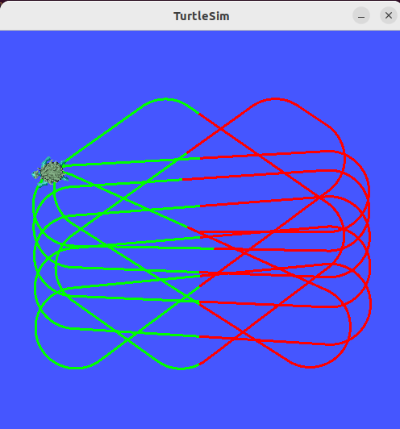
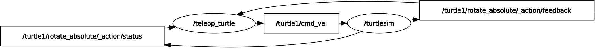

# my_robot_controller

## outcome preview
create a turtle with simple path logic




## setup
download vscode and use vscode extension: ROS

```
alan@alan-VirtualBox:~/git/rob521/ros2_ws$ colcon build
source ~/git/rob521/ros2_ws/install/setup.bash 
alan@alan-VirtualBox:~/git/rob521/ros2_ws$ ros2 pkg create my_robot_controller --build-type ament_python --dependencies rclpy
```

`colcon` is the build tool and `ament` is the build system

## build/run projct

install ros2 first, from this link: https://docs.ros.org/en/humble/Installation/Ubuntu-Install-Debians.html

here is my bashprofile setting
```
source /opt/ros/humble/setup.bash
source /usr/share/colcon_argcomplete/hook/colcon-argcomplete.bash
source ~/git/rob521/ros2_ws/install/setup.bash 
```

run turtle stimulator on first terminal
```
ros2 run turtlesim turtlesim_node
```

then run controllor on second terminal
```
cd ros2_ws
colcon build # or 'colcon build --symlink-install' if want hot reload
source ~/.bashrc
ros2 run my_robot_controller turtle_controller
```

## turtlesim overview


## usful cmd
### show message interface
```
alan@alan-VirtualBox:~/Desktop$ ros2 interface show geometry_msgs/msg/Twist
# This expresses velocity in free space broken into its linear and angular parts.

Vector3  linear
	float64 x
	float64 y
	float64 z
Vector3  angular
	float64 x
	float64 y
	float64 z
```


# ros2 notes
## important tips
1. if have more dependiencies, you should also mention the dependiencies inside package.xml
2. if colon build throw error due to path change, delete the build folder then build again

## quick start

start publisher, listener and graph
```
ros2 run demo_nodes_cpp talker
ros2 run demo_nodes_cpp listener
rqt_graph
```


## usful cmd
monitor node

```
alan@alan-VirtualBox:~/git/ros2_ws/src/my_robot_controller$ ros2 node info /first_node
/first_node
  Subscribers:

  Publishers:
    /parameter_events: rcl_interfaces/msg/ParameterEvent
    /rosout: rcl_interfaces/msg/Log
  Service Servers:
    /first_node/describe_parameters: rcl_interfaces/srv/DescribeParameters
    /first_node/get_parameter_types: rcl_interfaces/srv/GetParameterTypes
    /first_node/get_parameters: rcl_interfaces/srv/GetParameters
    /first_node/list_parameters: rcl_interfaces/srv/ListParameters
    /first_node/set_parameters: rcl_interfaces/srv/SetParameters
    /first_node/set_parameters_atomically: rcl_interfaces/srv/SetParametersAtomically
  Service Clients:

  Action Servers:

  Action Clients:
```

## service
start service server
```
ros2 run demo_nodes_cpp add_two_ints_server 
```

send request
```
alan@alan-VirtualBox:~/git/rob521/ros2_ws$ ros2 service  call /add_two_ints example_interfaces/srv/AddTwoInts "{'a':2,'b':3}"
requester: making request: example_interfaces.srv.AddTwoInts_Request(a=2, b=3)

response:
example_interfaces.srv.AddTwoInts_Response(sum=5)
```

change turtle path color to red
```
alan@alan-VirtualBox:~/git/rob521/ros2_ws$ ros2 service call /turtle1/set_pen turtlesim/srv/SetPen "{'r':255, 'g':0, 'b':0, 'width':6, 'off':0}"
requester: making request: turtlesim.srv.SetPen_Request(r=255, g=0, b=0, width=6, off=0)

response:
turtlesim.srv.SetPen_Response()
```

## check topic frequency
```
$ ros2 topic hz /turtle1/pose
```
```
WARNING: topic [/turtle1/pose] does not appear to be published yet
average rate: 62.413
	min: 0.007s max: 0.026s std dev: 0.00249s window: 64
average rate: 62.388
	min: 0.007s max: 0.026s std dev: 0.00202s window: 127
average rate: 62.481
	min: 0.007s max: 0.026s std dev: 0.00211s window: 190

```